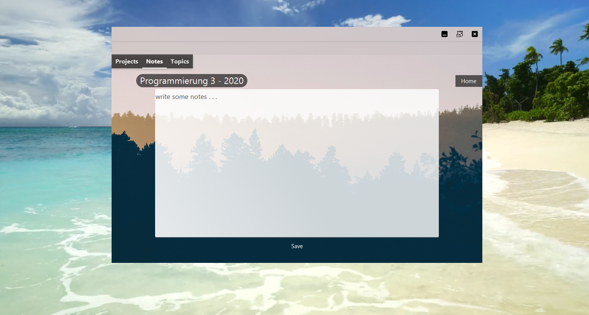
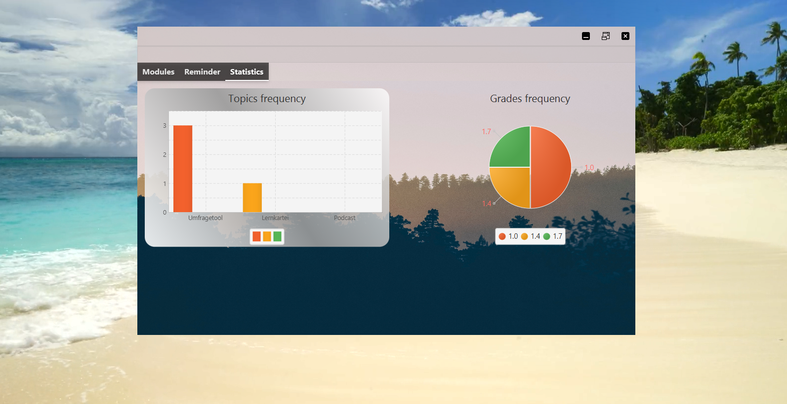

# Managemento
This project was developed to help lecturers at htw saar manage their students' projects.

Create new Module

created module cards

opened module card

create new project

error message for incorrect or missing information

create new topic

topic view

notes

project view

reminder view

appointment notification

statistics

